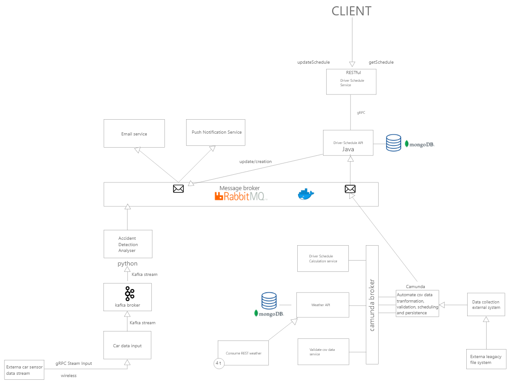

## Introduction
A larger driving school company has a legacy system in which all of their business processes are tied up. 
They are in the process of renewing their systems, and wanted a schedule planner for the course students.
When a group of new students are enrolled in class, a csv-file is sent from their legacy system.
The csv-files specify the data of the student and teacher such as name and email but also which days of the week they prefer to have the driving lesson.

Based on the csv-file the company wants a schedule planed for the students and the driving instructor, with the prefered days taken into account.
As additional features the schedule should take weather into account to avoid dangerous weather conditions.
The planned schedules are to be sent to the driver and the students that have the to partake in the driving lessons.

The cars of the driving school have sensors attached, in the event of unusual g-force readings the students must also be notified in case the car has been in a crash. So that they can reschedule their lesson.

## Technologies

| Name | Use | 
| --- | --- |
| Camunda | business process model and notation |
|RabbitMQ| message broker|
|Rest| Weather prediction |
|RESTfull| Api for clients outside of scope|
|gRPC
|kafka stream
|MongoDB|Data persistance|
|Docker|Containerrized|

## System design
